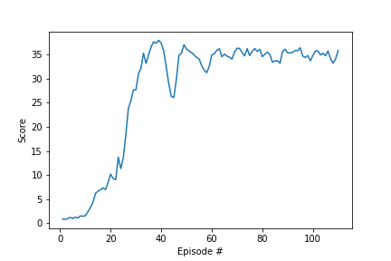

# DRLND_P2_Continuous_Control


## Problem Statement:
Goal is to move double jointed arm to target locations:


In this environment, a double-jointed arm can move to target locations. A reward of +0.1 is provided for each step that the agent's hand is in the goal location. Thus, the goal of your agent is to maintain its position at the target location for as many time steps as possible.

The observation space consists of 33 variables corresponding to position, rotation, velocity, and angular velocities of the arm. Each action is a vector with four numbers, corresponding to torque applicable to two joints. Every entry in the action vector should be a number between -1 and 1.

Your agents must get an average score of +30 (over 100 consecutive episodes, and over all agents). Specifically:
- After each episode, we add up the rewards that each agent received (without discounting), to get a score for each agent. This yields 20 (potentially different) scores. We then take the average of these 20 scores.
- This yields an average score for each episode (where the average is over all 20 agents).


## Setup the environment:
- Step 1: Clone the [DRLND Repository](https://github.com/udacity/deep-reinforcement-learning#dependencies)
- Step 2 Dpwnload the [Unity Environment](https://s3-us-west-1.amazonaws.com/udacity-drlnd/P2/Reacher/Reacher_Linux.zip)
 - Optional: Dependencies are detailed in drnld.yml file.  To install same environment the current code was executed:
```
conda env create -f environment.yml
```
This will install needed libraries. 


## Solution:
- 0) The code is motivated from the ddpg-pendulum exercise. 
- 1) Continuous_Control.ipynb describes the complete solution. 
- 2) ddpg_agent.py describes the DDPG based implementation.  
- 3) ddpg_agent.py also contains implementation of Ornstein-Uhlenbeck noise process and replay buffer. 
- 4) model.py describes the neural network used for function approximation. 
- 5) checkpoint_actor.pth stores the trained model weights for actor.
- 6) checkpoint_critic.pth stores the trained model weights for critic. 
- 7) Final score plot as number of episodes: 




## Details of the Implementation and Learning Algorithm

- All details are in Report.ipynb

## Future work: 
- 1) Use ideas from [Distributed Distributional Deterministic Policy Gradients](https://openreview.net/forum?id=SyZipzbCb) to further improve the perfomance 
- 2) Learn from pixels directly. 


